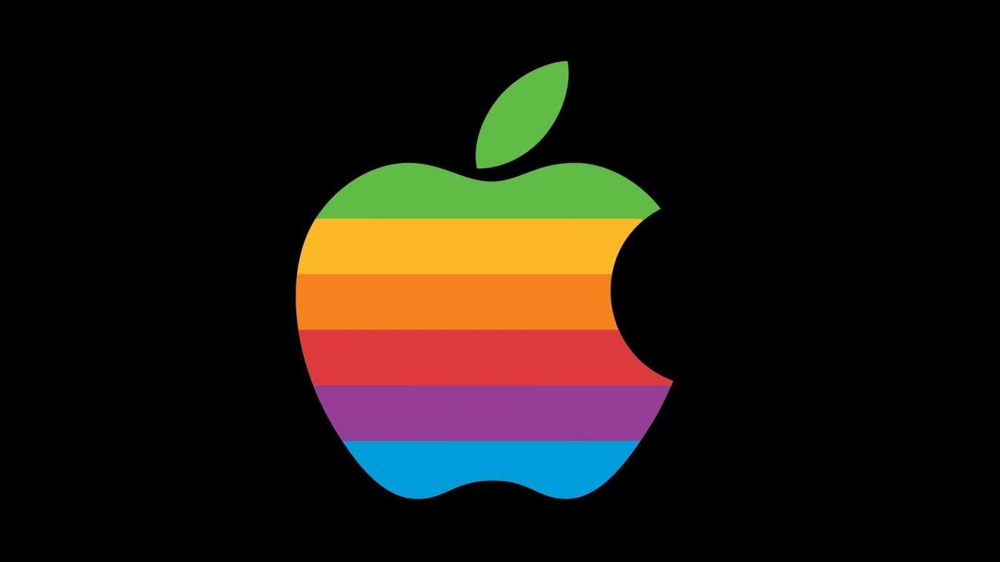

<!-- saved from url=(0104)file:///C:/Users/petro/Desktop/%D0%9D%D0%BE%D0%B2%D0%B0%D1%8F%20%D0%BF%D0%B0%D0%BF%D0%BA%D0%B0/News.html -->
<html><head><meta http-equiv="Content-Type" content="text/html; charset=windows-1252">
<meta name="GENERATOR" content="Microsoft FrontPage 3.0">
<meta name="Microsoft Theme" content="none">
<meta name="Microsoft Border" content="">
<title>News</title>
</head>

<body bgcolor="#000000" text="#FF0000">

<big><big><big><strong><em><big>NEWS</big></em></strong></big></big></big>

<em><strong>Here you can find some news from the CNN.com and NHL.com. To get scrypts working properly, use Internet Explorer 4.xx or newer.   </strong></em>

<iframe width="600" height="600" src="./myfav3_files/index.html" name="iframe" scrolling="auto"></iframe>

<iframe width="600" height="600" src="https://web.archive.org/web/20000815052826/http://www.cnn.com/" name="iframe" scrolling="auto">

<iframe width="600" height="600" src="./myfav3_files/saved_resource.html" name="iframe" scrolling="auto"></iframe>

<em><strong></strong></em>

@2021 Stan Donaldson 

&nbsp;&nbsp;&nbsp;&nbsp;&nbsp;&nbsp;&nbsp;&nbsp;&nbsp;&nbsp;&nbsp;&nbsp;&nbsp; 

</body></html>
